# ⌨️ Excel-5

## ✨ Project Description

**Excel-5** is a guide to basic keyboard shortcuts in Excel. Here you'll find practical tips, instructions, and illustrations about using keyboard shortcuts, function keys and inserting bullet points.

> 📚 **Goal:** Help you work faster and smarter in Excel—boosting your efficiency for everyday tasks!

---

## 📒 Table of Contents

- [Basic Shortcuts](#-basic-shortcuts)
- [Moving in Excel](#-moving-in-excel)
- [Selecting Ranges](#-selecting-ranges)
- [Sum Function](#-sum-function)
- [Formatting Cells](#-formatting-cells)
- [Function Keys](#-function-keys)
- [Inserting/Deleting Rows & Cells](#-insertingdeleting-rows--cells)
- [Bullet Points](#-bullet-points)
- [Custom Number Format](#-custom-number-format)
- [Screenshots](#-screenshots)
- [Requirements](#-requirements)
- [Author](#-author)

---

[Official documentation: Keyboard shortcuts in Excel](https://support.microsoft.com/en-us/office/keyboard-shortcuts-in-excel-1798d9d5-842a-42b8-9c99-9b7213f0040f)

---

## ⌨️ Basic Shortcuts

Select any cell in a range, then press `CTRL + A` to select the entire range.

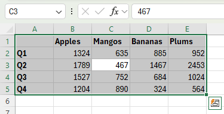
*Selecting a range with CTRL+A*

> 📝 **Tip:** Press `CTRL + A` again to select the entire sheet!

Copy (`CTRL + C`), cut (`CTRL + X`), and paste (`CTRL + V`) ranges quickly.

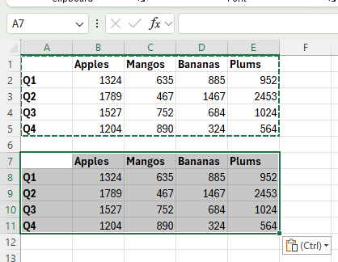
*Cutting a range*

> ℹ️ **Undo:** Press `CTRL + Z` to revert actions.

---

## 🚀 Moving in Excel

Select cell B2:

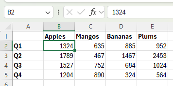

To move quickly:
- Hold `CTRL` and press ↓ to jump to the bottom of the range.
- Hold `CTRL` and press → to jump to the right of the range.

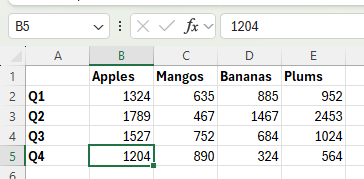

---

## 📐 Selecting Ranges

To select a range (e.g., A1:B3) using shortcuts:
1. Select cell A1.
2. Hold `SHIFT` and press ↓ twice.
3. Hold `SHIFT` and press → once.

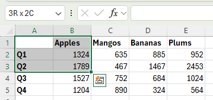

> 📝 **Tip:**  
> - `CTRL + SHIFT + ↓` selects a column of data.  
> - `CTRL + SHIFT + →` selects a row of data.

---

## ➕ Sum Function

Select cell B6. Quickly insert the SUM function with `ALT + =`, then press Enter.

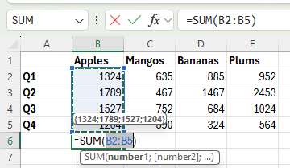

You can fill a formula right by pressing `CTRL + R`.

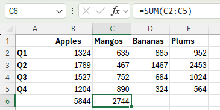

> ℹ️ **Fill Down:** Press `CTRL + D` to fill a formula down.

---

## 🎨 Formatting Cells

Launch the Format Cells dialog with `CTRL + 1`.  
Press `TAB`, press ↓ twice to select Currency format, then Enter.

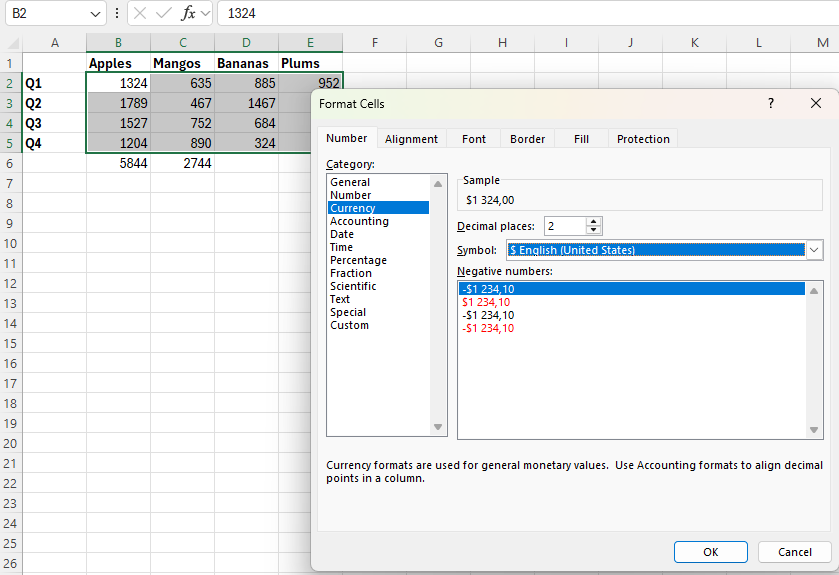

> 📝 **Bold:** Select the range and press `CTRL + B` to quickly bold cells.

---

## 🖱️ Function Keys

| Key | Action |
|-----|--------|
| **F1** | Opens Excel Help |
| **F2** | Moves insertion point to end of active cell |
| **F3** | Displays Paste Name dialog |
| **F4** | Cycles cell reference types |
| **F5** | Displays Go To dialog |
| **F6** | Moves to next pane in split worksheet |
| **F7** | Spelling dialog |
| **F8** | Extend mode toggle |
| **F9** | Calculates all open workbooks |
| **F10** | Shows key tips (ALT) |
| **F11** | Creates chart sheet |
| **F12** | Save As dialog |

---

## ➕➖ Inserting/Deleting Rows & Cells

To insert rows:
1. Select row(s).
2. Press `CTRL + SHIFT + +`.

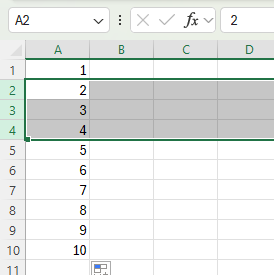
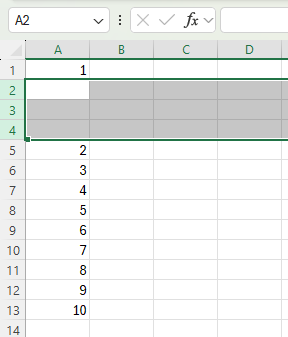

> ℹ️ **Insert cells:** Select cell → `CTRL + SHIFT + +` → Excel selects "Shift cells down". Click OK.

To delete rows/cells:
- Select rows/cells, then press `CTRL + -`.

---

## • Bullet Points

To insert a filled round bullet:
- Press `Alt + Numpad 7`.
- NumLock may need to be turned on.

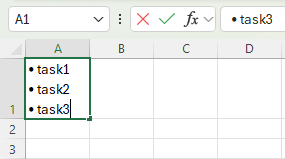

> 📝 **New Line:** Press `Alt + Enter` to start a new line in a cell.

---

## 🔢 Custom Number Format

1. Select range C2:C6.
2. Right-click, choose Format Cells.
3. Select Custom.
4. In Type, press `Alt + Numpad 7` for bullet, enter space, then `@`.
5. Click OK.

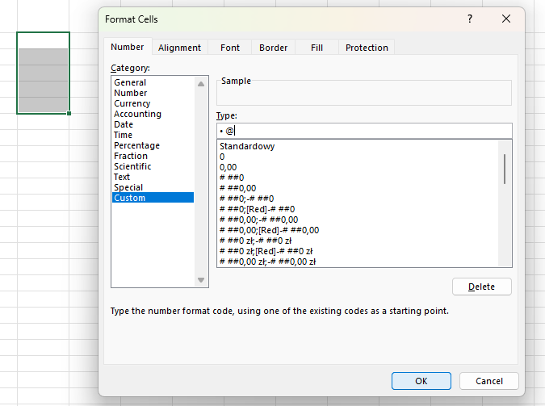

*Now you can create a bulleted list by typing items!*

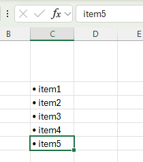

> ℹ️ **No Numpad?** On Insert tab, in Symbols group, click Symbol.

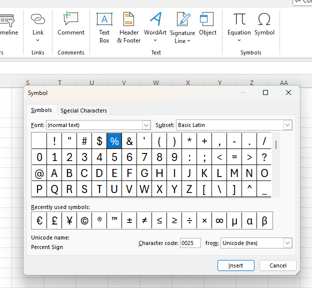

---

## 📷 Screenshots

All screenshots are available in the `/Screenshots` folder.

---

## ℹ️ Requirements

- Microsoft Excel (all modern versions)
- Windows OS recommended for shortcuts

---

## 👨‍💻 Author

Project and documentation by **Kuba27x**  
Repository: [Kuba27x/Excel-5](https://github.com/Kuba27x/Excel-5)

---
